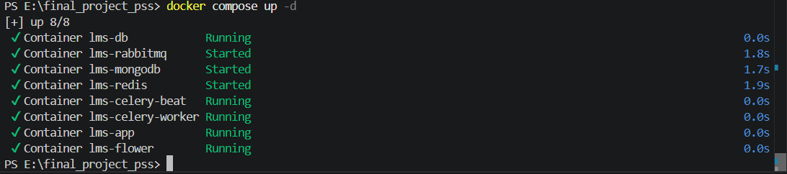
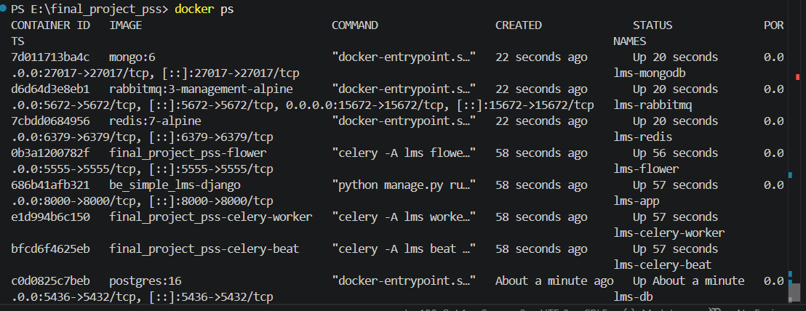
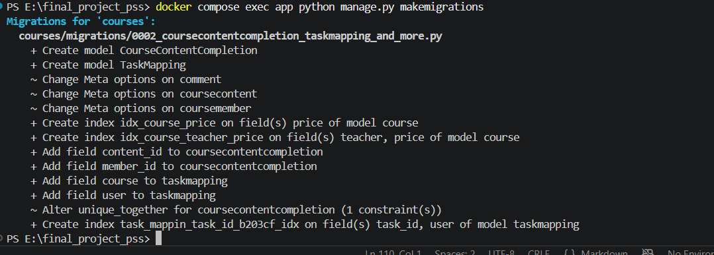

# Final Project: Learning Management System (LMS)

Simple LMS adalah sistem manajemen pembelajaran berbasis web yang dibangun dengan Django REST Framework. Proyek ini menonjolkan kemampuan asynchronous untuk menjaga responsivitas dan otomatisasi proses berat.


## Ringkasan Teknologi

- Django REST Framework
- PostgreSQL
- Celery + RabbitMQ
- Redis
- MongoDB
- Docker Compose
- Flower
- ReportLab dan CSV

## Fitur Utama

- Email notification asynchronous ketika user mendaftar course
- Generate certificate PDF secara asynchronous
- Export report CSV secara asynchronous
- Scheduler Celery Beat untuk update statistik dan laporan harian
- Endpoint monitoring task: `/api/tasks/{task_id}`
- Flower monitoring di `http://localhost:5555`

## Dukungan Role

- Admin
- Instructor
- Student

## Model Utama

| Model | Fungsi |
|-------|--------|
| **User** | Menyimpan data pengguna dan role **Admin**, **Instructor**, **Student** |
| **Course** | Menyimpan informasi course seperti judul, deskripsi, harga, dan pengajar |
| **CourseContent** | Menyimpan materi pembelajaran untuk setiap course |
| **CourseMember** | Menyimpan data mahasiswa yang sudah terdaftar pada course |
| **CourseContentCompletion** | Menyimpan progress mahasiswa terhadap lesson |
| **Comment** | Menyimpan komentar mahasiswa pada materi pembelajaran |

## Fitur Tambahan (Custom)

| No | Fitur | Keterangan |
|----|-------|-----------|
| 1 | Email Notification Async | Mengirim email/background notification secara asynchronous dengan Celery |
| 2 | Generate Certificate Async | Membuat sertifikat PDF di background menggunakan ReportLab |
| 3 | Export Report Async | Mengekspor laporan CSV di background |
| 4 | Scheduled Task | Menjalankan task `update_course_statistics` dan `send_daily_report` secara otomatis |
| 5 | Task Status Endpoint | Monitoring status task dengan `/api/tasks/{task_id}` |
| 6 | Flower Monitoring | Monitoring Celery worker melalui `http://localhost:5555` |

## Cara Menjalankan Project

### 1. Clone Repository

```bash
git clone https://github.com/Fabianadam21/final_project_pss.git
```

### 2. Jalankan Docker Compose

```bash
docker compose up -d --build
```


```bash
docker compose up -d
```


### 3. Periksa container

```bash
docker ps
```


### 4. Migrasi database

```bash
docker compose exec app python manage.py makemigrations
```


```bash
docker compose exec app python manage.py migrate
```


### 5. Seed data

```bash
docker compose exec app python manage.py seed_data
```


### 6. Hentikan project

```bash
docker compose stop
```


## Akun Demo

| Role           | Username  | Password       |
| -------------- | --------- | -------------- |
| **Admin**      | `admin`   | `admin123`     |
| **Instructor** | `dosen01` | `dosen123`     |
| **Student**    | `mhs001`  | `mahasiswa123` |


## Endpoint Utama

### Authentication
  
  | Method | Endpoint             |
  | ------ | -------------------- |
  | POST   | `/api/auth/register` |
  | POST   | `/api/auth/login`    |
  | POST   | `/api/auth/refresh`  |
  | GET    | `/api/auth/me`       |
  | PUT    | `/api/auth/me`       |
  
### Courses

| Method | Endpoint                     |
| ------ | ---------------------------- |
  | GET    | `/api/courses`               |
  | POST   | `/api/courses`               |
  | GET    | `/api/courses/{id}`          |
  | PATCH  | `/api/courses/{id}`          |
  | DELETE | `/api/courses/{id}`          |
  | GET    | `/api/courses/{id}/contents` |
  | GET    | `/api/courses-cached`        |
  
### Enrollments

| Method | Endpoint                         |
| ------ | -------------------------------- |
  | POST   | `/api/enrollments`               |
  | GET    | `/api/enrollments/my-courses`    |
  | POST   | `/api/enrollments/{id}/progress` |
  
### Async Tasks (Celery)

| Method | Endpoint                           |
| ------ | ---------------------------------- |
  | POST   | `/api/enrollments-async`           |
  | POST   | `/api/courses/{id}/complete-async` |
  | POST   | `/api/courses/{id}/export-async`   |
  | POST   | `/api/admin/update-stats`          |
  | GET    | `/api/tasks/{task_id}`             |
  
### Analytics

| Method | Endpoint                         |
| ------ | -------------------------------- |
  | GET    | `/api/analytics/popular-courses` |
  | GET    | `/api/analytics/my-activities`   |

### Monitoring

| Service | URL | 
|---------|-----|
| Flower | http://localhost:5555 | 
| RabbitMQ Management | http://localhost:15672 |


---

**Dokumentasi lengkap:** Lihat [FINAL_PROJECT_REPORT.md](FINAL_PROJECT_REPORT.md)


