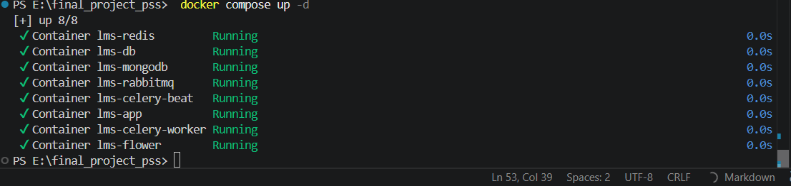
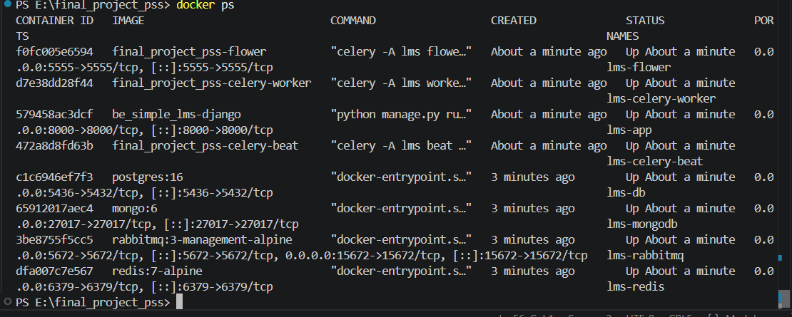
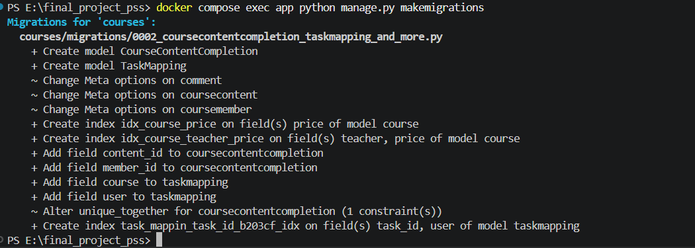
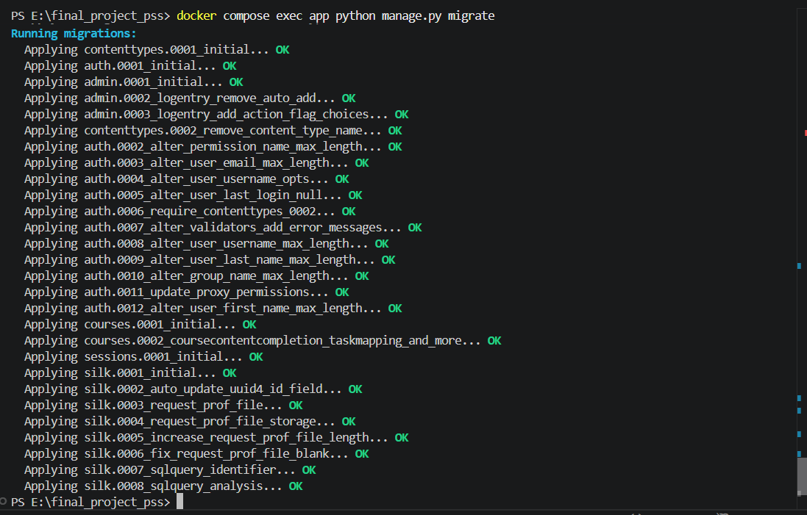
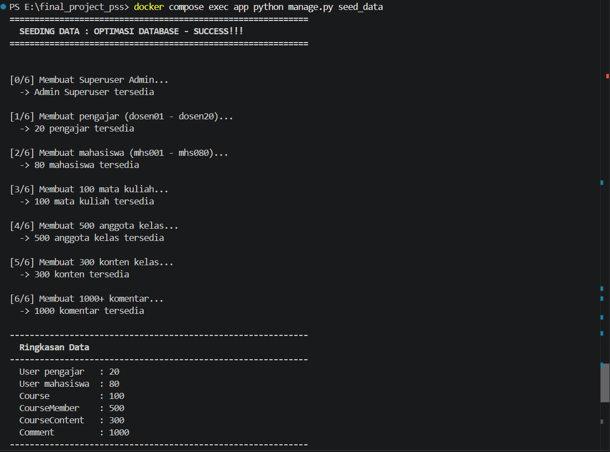
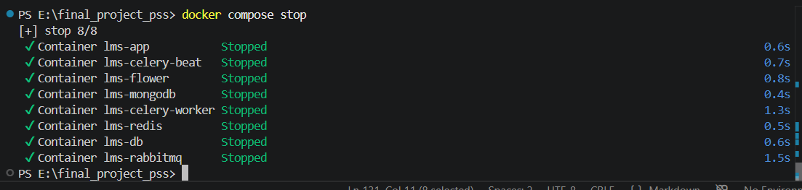

# Final Project: Learning Management System (LMS)

Simple LMS adalah sistem manajemen pembelajaran berbasis web yang dibangun dengan Django REST Framework. Proyek ini mengintegrasikan teknologi modern seperti Celery untuk background processing, Redis untuk caching, MongoDB untuk logging, dan RabbitMQ sebagai message broker.

Sistem mendukung tiga peran pengguna (Admin, Instructor, Student) untuk mengelola course, enrollment, tracking progress, serta generate sertifikat dan laporan secara otomatis dengan proses asynchronous.


## Model Utama

| Model | Keterangan |
|-------|------------|
| **User** | Menyimpan data pengguna dengan peran **Admin**, **Instructor**, dan **Student**. |
| **Course** | Menyimpan informasi utama mengenai mata kuliah, seperti nama, deskripsi, harga, dan pengajar. |
| **CourseContent** | Menyimpan materi pembelajaran (lesson) yang terdapat pada setiap course. |
| **CourseMember** | Menyimpan data mahasiswa yang telah melakukan enrollment pada suatu course. |
| **CourseContentCompletion** | Menyimpan progress pembelajaran berdasarkan lesson yang telah diselesaikan oleh mahasiswa. |
| **Comment** | Menyimpan komentar yang diberikan mahasiswa pada materi pembelajaran. |


## Fitur Utama - Async Processing & Notification

| No | Fitur | Deskripsi |
|----|-------|-----------|
| 1 | **Email Notification (Async)** | Mengirim email atau mock email secara asynchronous menggunakan Celery. |
| 2 | **Generate Certificate (Async)** | Membuat sertifikat PDF sebagai background task menggunakan ReportLab. |
| 3 | **Export Report (Async)** | Mengekspor laporan dalam format CSV sebagai background task. |
| 4 | **Scheduled Task (Celery Beat)** | Menjalankan task pembaruan statistik course secara otomatis setiap satu jam. |
| 5 | **Task Status Endpoint** | Menyediakan endpoint `/api/tasks/{task_id}` untuk mengecek status task asynchronous. |
| 6 | **Flower Monitoring** | Monitoring worker Celery melalui Flower yang dapat diakses di `http://localhost:5555`. |


## Cara Menjalankan Project

### 1. Clone Repository

```bash
git clone https://github.com/Fabianadam21/final_project_pss.git
```

### 2. Jalankan Docker Compose

Pertama kali (build image baru):
```bash
docker compose up -d --build
```

Jika sudah ada:
```bash
docker compose up -d
```



### 3. Pastikan Container Berjalan

```bash
docker ps
```



### 4. Buat migration dahulu

```bash
docker compose exec app python manage.py makemigrations
```



### 5. Jalankan migration

```bash
docker compose exec app python manage.py migrate
```



### 6. Seed Data

```bash
docker compose exec app python manage.py seed_data
```



### 7. Menghentikan Project

```bash
docker compose stop
```



## Akun Demo

| Role           | Username  | Password       |
| -------------- | --------- | -------------- |
| **Admin**      | `admin`   | `admin123`     |
| **Instructor** | `dosen01` | `dosen123`     |
| **Student**    | `mhs001`  | `mahasiswa123` |


## Endpoint Utama

### Authentication
  
  | Method | Endpoint             |
  | ------ | -------------------- |
  | POST   | `/api/auth/register` |
  | POST   | `/api/auth/login`    |
  | POST   | `/api/auth/refresh`  |
  | GET    | `/api/auth/me`       |
  | PUT    | `/api/auth/me`       |
  
### Courses

| Method | Endpoint                     |
| ------ | ---------------------------- |
  | GET    | `/api/courses`               |
  | POST   | `/api/courses`               |
  | GET    | `/api/courses/{id}`          |
  | PATCH  | `/api/courses/{id}`          |
  | DELETE | `/api/courses/{id}`          |
  | GET    | `/api/courses/{id}/contents` |
  | GET    | `/api/courses-cached`        |
  
### Enrollments

| Method | Endpoint                         |
| ------ | -------------------------------- |
  | POST   | `/api/enrollments`               |
  | GET    | `/api/enrollments/my-courses`    |
  | POST   | `/api/enrollments/{id}/progress` |
  
### Async Tasks (Celery)

| Method | Endpoint                           |
| ------ | ---------------------------------- |
  | POST   | `/api/enrollments-async`           |
  | POST   | `/api/courses/{id}/complete-async` |
  | POST   | `/api/courses/{id}/export-async`   |
  | POST   | `/api/admin/update-stats`          |
  | GET    | `/api/tasks/{task_id}`             |
  
### Analytics

| Method | Endpoint                         |
| ------ | -------------------------------- |
  | GET    | `/api/analytics/popular-courses` |
  | GET    | `/api/analytics/my-activities`   |

### Monitoring

| Service | URL | 
|---------|-----|
| Flower | http://localhost:5555 | 
| RabbitMQ Management | http://localhost:15672 |


---

**Dokumentasi lengkap:** Lihat [FINAL_PROJECT_REPORT.md](FINAL_PROJECT_REPORT.md)


